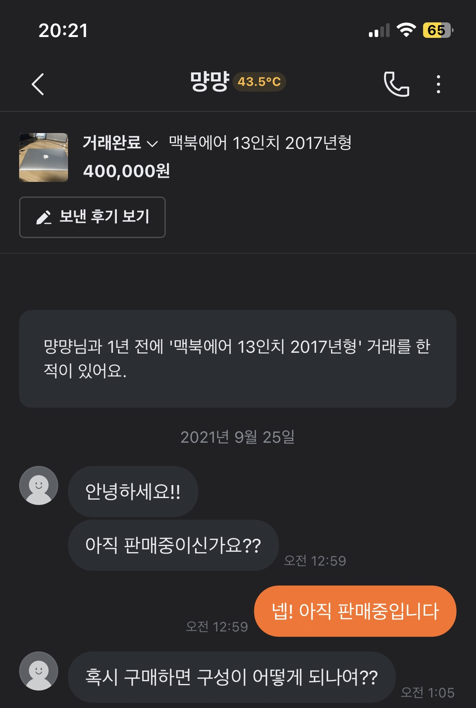

# Functional Specification

## 👤 User
* 유저가 사용할 기능
  * 회원 가입
  * **<u>회원 차단 혹은 당근 매너 온도 처럼 유저 평가하기</u>**
  * 회원 탈퇴
  * 로그인
  * 로그아웃
  * 게시글 관련
    * 본인 게시글 조회
    * 본인 게시글 수정
    * 본인 게시글 삭제
    * 본인 댓글 삭제
  * 상품 & 스크랩관련
    * 본인 상품 거래상태 변경
    * 본인 관심 상품 조회
    * 관심 상품 등록
    * 관심 상품에서 삭제
  * 다른 유저에게 쪽지 보내기

## 📃 Post
* 유저들은 자신이 물물교환할 제품을 사진과 함께 글로 올릴 수 있음
  * 예시)
  * 글제목 : 명절 선물로 받은 샴푸입니다
  * 글내용 : 명절 선물로 받은 샴푸인데 자취해서 너무 많이 남네요. 치약과 교환을 희망합니다
* 자신이 올리는 상품 카테고리 등록해야함
* 자신이 받고 싶은 물건 카테고리 선택해야함
  * **<u>이때, 올리는 상품과 같은 카테고리를 선택하면 자동으로 끼리끼리 교환하고 싶은 상품으로 등록</u>**
* 게시글에 해쉬태그를 포함해서 작성 가능
  * 해쉬 태그는 검색(필터링)에 사용된다
* 게시글은 3가지 방식으로 검색(필터링)된다
  * 해쉬 태그 방식 : 사용자가 검색한 해쉬태그를 게시글이 포함하면 노출되는 방식
  * 상품 카테고리 방식 : 사용자가 책 카테고리를 선택하면 책 상품 카테고리가 책인 게시글이 노출되는 방식
  * 받고 싶은 물건 카테고리 방식 : 사용자가 받고싶은 물건 카테고리로 책을 선택하면 책과 교환을 희망하는 사용자들의 게시글 노출
    * 예시) 책과 거래를 희망하는 샴푸 게시글이나, 핫팩 등등의 게시글이 노출
* 유저는 게시글에 있는 관심 상품 등록 버튼으로 관심 상품으로 등록할 수 있어야함
* **<u>게시글 신고기능</u>**
* 쪽지 보내기 버튼을 누르면 당근 마켓과 같이 상품에 대한 대화방이 개설, 대화방을 통해 상대방에게 쪽지를 남길 수 있음
* 생성되는 대화방 예시)

## ✏️ Comment
* 게시글에 대하여 궁금한 점을 편하게 댓글로 남길 수 있음
* 대댓글까지 작성 가능
* 예시)
  * 철웅 : ~~~
    * 동준 : ~~~
    * 철웅 : ~~~~
    * 동준 : ~~~~
    * 끝
  * 철웅 : ~~~~
    * 동준 : ~~~
    * 끝
* 익명 댓글
* 댓글 삭제 가능
* **<u>댓글 신고 기능</u>**

## 📨 Message
* 일대일 대화방에 쌓이는 메시지들
* 채팅 메시지와 비슷해보이지만 실시간성을 살리기 어려우니 쪽지와 비슷한 느낌
* 교환 의사를 표현하고 교환을 확정하고 약속을 잡는 용도로 사용

## ❤️ Scrap
* 관심 상품을 모아보는 기능
* 유저는 다른 사용자가 올린 게시글에 관심상품 등록 버튼을 누르면 해당 상품을 본인의 관심 상품 리스트에서 조회 가능해야함
* 본인의 관심 상품에 대한 거래 상태도 확인할 수 있어야함

## 🏷️ Category
* 게시글에는 올린 상품 카테고리 정보가 들어감
* 교환을 희망하는 제품 카테고리도 선정가능

