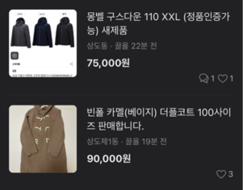

# 물물교환 플랫폼 - 🔥화개장터🔥

동네 사람들끼리 하는 물물교환 플랫폼   
분야별로 물물교환을 할 수도있고, 그냥 교환도 가능
    
ex) 책 - 책
- 책
- 옷
- 장난감
- 아기용품
- 스팸
- 샴푸
- 귤 한박스 나눠가지실분
- 파
    
**가치가 낮은 물건**

이 주 타겟이 될것으로 예상?
    
자취하는 사람들에게 좋음
    
### 기능 나열

책끼리 교환
    
옷끼리 교환

아기용품끼리 교환
    
식품끼리 교환
    
그외 주제 상관없는 물물교환 
    
긴급 ! 포인트
    

---
    
- 위치기반으로 동네인증을 할 수 있어야함
- 시작할때 로그인 정보 : 자취 , 애기맘, 미리 정하기
- 유저평가(당근온도)
- 관심 체크하면 알림이 가야함
- 상대방이 알림을 확인하고 가지고 있는 물건을 체크할 수 있다
 
    

---

    
### 물건을 올릴때
    
- 선호하는 거래 지역 입력
  - 줄글로 어디서 거래하고 싶은지 적기
- 올리는 물건이 어떤 주제인지 입력
  - 당근과 같이 큰틀로 나누면 될듯
  - 나중에 다른 사용자가 검색할때 사용
- 뭐랑 바꾸고 싶은지
  - 당근과 같이 큰틀로 나누면 될듯
  - 줄글로 : 과자 포카칩을 좋아하긴 해요,
  - 윤정이 이슈 나중에 또 얘기해) 카테고리 분리 이런거있잖아 나중에얘기해
- 가치 산정을 어떻게할건지
  - 본인이 생각하는 가치를 정하는걸로 1000원 단위 1000원, 3000원, 30000원
    
돼지고기 200g 올리고 싶고 소고기를 받고 싶어 
     
- 사진올리고
- 제목써
- 올리는 물건 카테고리 입력
- 받고싶은 물건 카테고리 입력
- 줄글로 소고기가 좋아용 쓰고(선호하는 물건 줄글로 쓰기)
- 본인이 생각하는 물건 가격
- 돼지고기 신선함 언제샀고 개맛있음
- 거래지역 동네가 좋음
- 올려

    
---

    
### 검색
    
- 카테고리 눌렀을때 품목만 띄워줌
- ~~단어 유사도 고려해서 검색~~
- 태그
- 가격별 필터링
- 관심없는 품목 필터링
- 관심있는 물건 체크
    
이쪽 백엔드가 알아서 하겠죠
    
올리브유 검색
    
- 올리브유를 원하는 사람이 올린 제품이 나옴(스팸)
- 올리브유가 나옴
    
필터 형식으로 분리
    
### 교환하고 싶은 물건을 찾았을때
    

    
- 하트 누를수 있음
  - 하트 누르면 상대방이 자기가 올린 물품리스트를 볼 수 있다
  - 관심 리스트에 추가
- 댓글
  - 올린 상품에 대해 질문할 수 있다
  - 대댓글 ? 채팅을 대신하는거니까 무한으로 되어야함
  - 비밀댓글 설정가능
  - 댓글 쓰다가 거래를 할 수 있음
        
    
---

    
### 거래
    
- 게시글에서 시작 : 교환 버튼
        

        
매너온도쪽에 교환하기 버튼이 있음
        
- 자신의 품목 리스트가 뜬다
- 리스트중 교환할 품목 선택
- 상대방 알림이가고 수락하면 “거래중”이 된다
- 만나서 교환완료하면 완료
    
교환 요청하기 버튼
    
- 예시) 김동준이라는 사람이 홍의성 쌀을 가지고 싶어함
- 김동준이 홍의성 쌀 게시글에 교환 신청하기 버튼을 누름
- 홍의성한테 교환 요청이 왔다는 알림이 뜸
- 그 버튼 누르면 김동준 프로필로 이동해서 김동준 물건이 나옴
- 홍의성이 김동준 물건중 가지고 싶은것을 선택함
- 다시 김동준한테 교환 요청에 대한 답이 왔다는 알림이 나옴
- 김동준도 그 요청이 마음에 들면 교환 수락하기를 눌러서 교환이 성립된다
    
물건 두개 , 하나 교환하는 방식은?
    
복수선택?

    
---

    
### 홈 화면
    
- 동네에 있는 물품들 살펴보기
- 카테고리별로, 가격별로 필터링
- 책끼리 교환, 옷끼리 교환 등의 버튼이 있다
    
장점: 사기당할일이 없다
    
     
    
     
    
### 상태
    
- 거래 전 :
- 거래 중 : 약속은 잡았으나 안만남
- 거래 완료 : 만나서 교환하면 완료
    
- 로그인
    - 카톡, 구글로그인?
        
- 게시판
    - 게시글 올린 물건에 대한 주제 태그
    - 받고싶은 물건에 대한 주제 태그
    - 채팅대신 댓글로 해야할듯
        - 비밀댓글로 구현하는 방향
        - 승낙하는 방식?
    - 게시글 올릴때 같은 품목끼리 교환할지 미리 체크
        - ex) 책끼리 교환, or 품목 상관없이 교환
        
  - 태그 (물건에 대한 태그)
  - 검색
      - 카테고리로 검색
      - 제목으로 검색
        
    
- ~~채팅은 안하기로~~
    
무드등 → **마우스**. 키보드 갖고싶다고 게시글 올릴때 같이 게시
    
마우스 서칭하면 무드등이 나옴, 
    
올리브유 검색 → 올리브유를 원하는 사람들의 물물교환 제품이 나옴
    
절대적인 가치를 정할 필요가 없음
    
올리브유 검색
    
- 올리브유를 원하는 사람이 올린 제품이 나옴(스팸)
- 올리브유가 나옴
    
필터 형식으로 분리